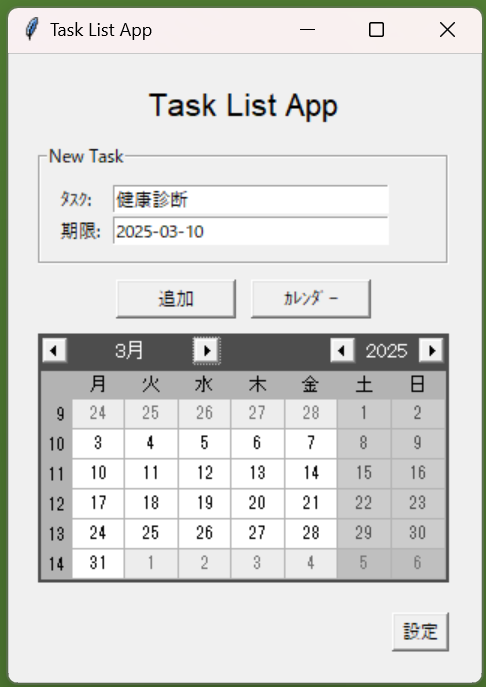

# Todoリストアプリ

定番のTodoリストのデスクトップアプリです。  
Python学習の一環として生成AIにサポートしてもらいながら作成しました。

---

## プロジェクト概要

**目的**  
アプリケーションの開発を通じて参考書では得られない実践的な知識を習得すること。

**使用技術**  
- フロントエンド    ：tkinter  
- バックエンド      ：Python
- データベース      : T.B.D(検討中)
- 生成AI支援        ：Codeium(VSCode拡張機能)

**ライセンス**  
このプロジェクトは MIT License のもとで公開されています。  
※非商用目的でご利用ください。

## アプリケーションの概要

### 主な機能
- **タスクの作成**:
  - 入力項目: タイトル、期限

- **タスクの表示**:
  - 一覧表示（すべてのタスク）
  - 詳細表示（個別タスクの詳細情報）

- **タスクの編集**:
  - タイトル、詳細、期限の変更

- **タスクの削除**
  - 完了したタスクを削除

- **タスクの状態変更**:
  - 未完了、進行中、完了の3状態を管理

- **データ保存・読み込み**:
  - タスクデータを保存・読み込み
  - ファイルが存在しない場合は自動的に新規作成

- **デザインカスタマイズ**
  - テーマカラー変更 

### 必須環境
- Python 3.8以上

### 使用方法
1. リポジトリをクローン
```bash
git clone https://github.com/HI-0705/Todo_List_App.git
cd Todo_List_App
```

2. 依存関係をインストール
```bash
pip install -r requirements.txt
```

3. アプリケーションを起動
```bash
python main.py
```

### 注意事項
本アプリケーションは学習目的で作成したものであり、
実用性や完全なバグフリーを保証するものではありません。  
作者はソフトウェアに対して一切の動作保証、および責任を負いません。
